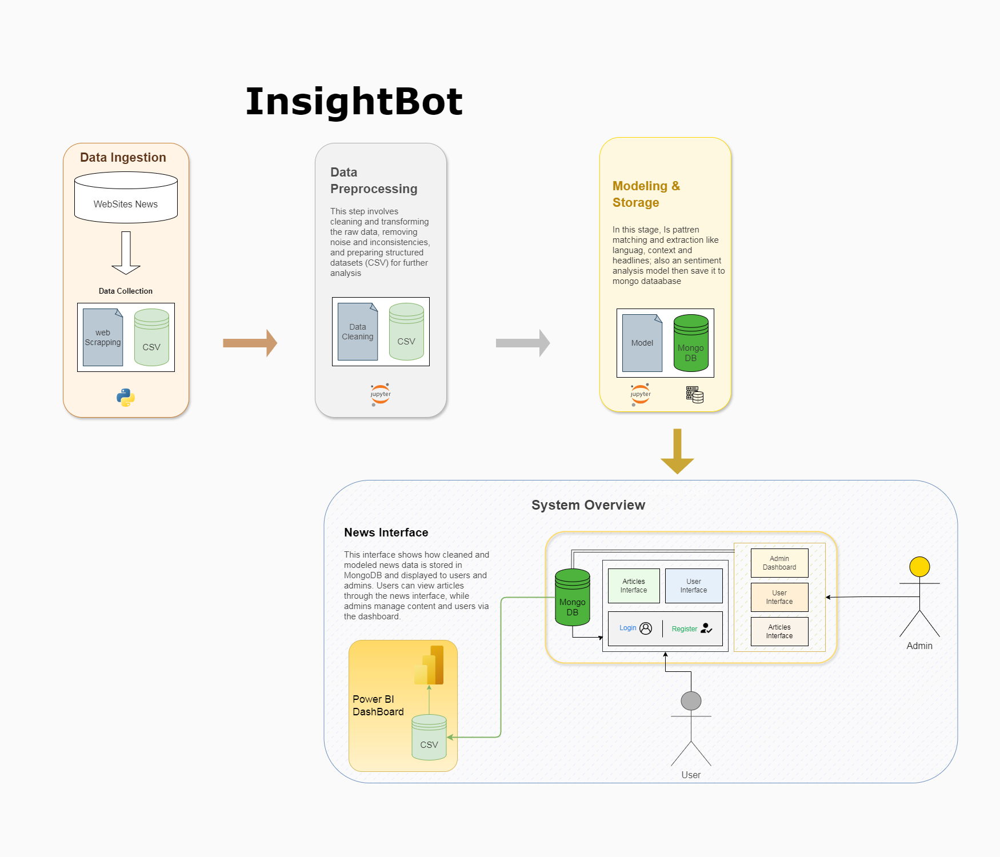
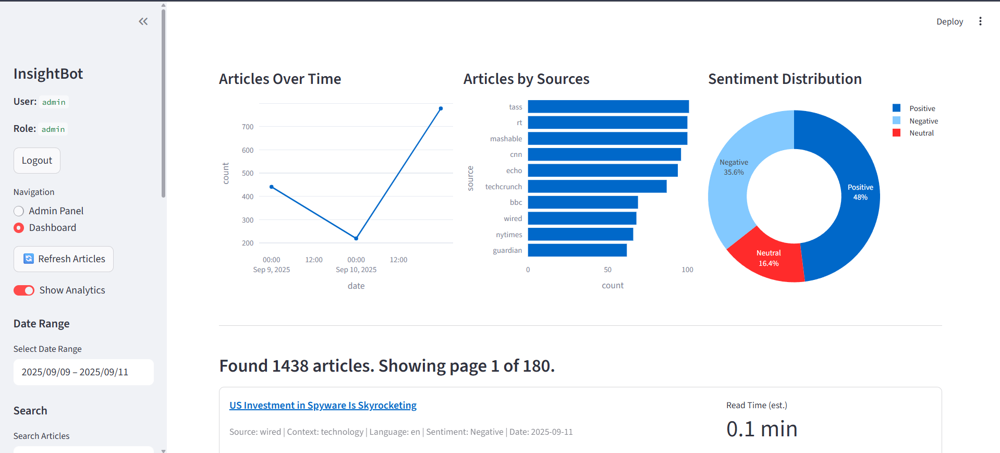
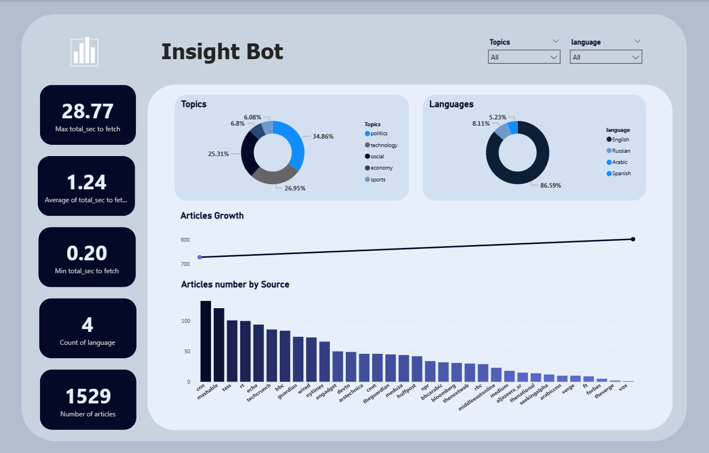

# 🚀 InsightBot


Automated News Analytics & Visualization System


---

## 📑 Table of Contents

* [Description](#description)
* [Features](#features)
* [Tech Stack](#tech-stack)
* [Getting Started](#getting-started)
* [Usage](#usage)
* [Screenshots](#screenshots)
* [License](#license)

---

## 💡 Blog

[Medium Blog: InsightBot – Simplifying Daily News with Data Science & Visualization](https://medium.com/@dsdataminds/insightbot-simplifying-daily-news-with-data-science-visualization-455ba5cfdde2)

---

## 📝 Description

*InsightBot* is an automated news scraping and analytics system designed to collect, process, and visualize news from *30+ websites*.
It delivers structured insights with multilingual support and interactive dashboards.

Main workflow:

1. *Data Collection* → Scrape news & articles from multiple sources.
2. *Data Cleaning & Processing* → Structure and preprocess data.
3. *Modeling & Analysis* → Extract *topics*, generate *headlines*, detect *languages*.
4. *Data Storage* → Save processed data in *MongoDB*.
5. *User Interface* → Explore via *Streamlit* (Admin & User roles).
6. *Reporting & Visualization* → Advanced insights through *Power BI* dashboards.

> 💡 InsightBot helps organizations monitor news, extract insights, and visualize trends in real-time.

---

## 🔄 Workflow



---

## 📊 Features

* 🔄 Automated scraping of 30+ news websites
* 🧠 Topic extraction & context classification
* 🌐 Multi-language detection & headline generation
* 💾 MongoDB integration for efficient data storage
* 🎨 Streamlit-based interactive interface (admin & user roles)
* 📈 Power BI dashboards for advanced reporting
* 🔐 Secure authentication (login/register)
* ⚙ Workflow orchestration with *Perfect*

---

## ⚙ Tech Stack

* *Python* → Scraping, cleaning, NLP modeling
* *Libraries* → Pandas, BeautifulSoup / Scrapy, NLP models
* *Database* → MongoDB
* *Frontend* → Streamlit
* *Visualization* → Power BI
* *Orchestration* → Perfect

---

## ⚙ Installation Guide

1. Clone repository:

```bash
git clone <repo-url>
cd InsightBot
```

2. Create virtual environment:

```bash
python -m venv .venv
source .venv/bin/activate   # Linux/Mac
.venv\Scripts\activate      # Windows
```

3. Install requirements:

```bash
pip install -r requirements.txt
```

---

## 🗄 MongoDB Setup

1. Start your MongoDB service (local or remote).

2. Run initialization script:

```bash
python init_schema.py
```

3. Seed default data:

```bash
python seed_data.py
```

4. Import sample articles (choose one option):

### ▶ Regular Import (simple add)

```powershell
& "C:\Program Files\MongoDB\tools\bin\mongoimport.exe" `
  --db insightbot `
  --collection articles `
  --type csv `
  --file "C:\Users\moham\Desktop\Insightbot\Interface\insightbot_seed\news_articles.csv" `
  --headerline
```

### ▶ Re-import / Update Without Duplicates

```powershell
& "C:\Program Files\MongoDB\tools\bin\mongoimport.exe" `
  --db insightbot `
  --collection articles `
  --type csv `
  --file "C:\Users\moham\Desktop\Insightbot\Interface\insightbot_seed\news_articles.csv" `
  --headerline `
  --upsert `
  --upsertFields id
```

### ▶ Full Reset Import (Clean Slate)

```powershell
& "C:\Program Files\MongoDB\tools\bin\mongoimport.exe" `
  --db insightbot `
  --collection articles `
  --type csv `
  --file "C:\Users\moham\Desktop\Insightbot\Interface\insightbot_seed\news_articles.csv" `
  --headerline `
  --drop
```

---

## ⚡ Perfect Pipeline

1. Start Perfect server (optional for orchestration UI):

```bash
Perfect server start
```

2. Run the Perfect flow to orchestrate scraping and processing:

```bash
python flows/pipeline.py
```

3. Monitor and manage pipeline runs via Perfect UI at [http://localhost:4200](http://localhost:4200).

---

## ▶ Running the Application

```bash
streamlit run app.py
```

Open in browser: [http://localhost:8501](http://localhost:8501)

---

## 🧱 Database Schema

Collections:

* *users* → username, email, password_hash, role, is_approved, join_date, time_spent_minutes
* *logs* → ts, user, event, meta
* *articles* → id, title, content, source, language, context, sentiment, url, fetched_at, t_total_sec
* *app_store* → key, value

Indexes are defined in `init_schema.py`.

---

## 👤 Usage

* *Admin* → Manage users, monitor dashboards, oversee system
* *User* → Register/login to view personalized news & dashboards

---

## 🌟 Features

### ✅ User Dashboard

* Browse articles with filters: date, language, sentiment, context, search
* Export results to CSV
* View analytics charts: articles over time, articles by source, sentiment distribution, heatmap
* Open article view + recommendations
* Pagination for articles

### ✅ Admin Panel

* KPI cards (Total Users, Logins, Reads, Total Articles, Pending Approvals, Fetch Jobs)
* Visualizations (activity trend, reads by context, ingestion rhythm, top users by time spent)
* User management (add/update/approve/reject users)

---

## 🔐 Authentication & Security

* Passwords are hashed with *bcrypt*
* Only *approved users* can log in
* Admin role required for Admin Panel
* Unique constraints on usernames and emails

---

## 📊 KPIs & Visualizations

* *User Dashboard*: articles over time, top sources, sentiment distribution, heatmap
* *Admin Panel*: activity trend, reads by context, articles per hour, top users

---

## 🌱 Default Data & Seeding

* *Admin user*:

  * Username: admin
  * Password: admin123
* *App store defaults*: last_page = dashboard, app_version = 1.0.0

---

## 📸 Screenshots

### Streamlit Interface



### Power BI Dashboard



---

## 📜 License

This project is licensed under the *MIT License*.
